分工:

侯懿轩：练习一二部分的代码的书写和优化，练习2报告的书写，lab2分支的调试。

姚鑫秋：练习一二部分的代码的书写和优化，练习1报告的书写，lab5分支的调试。

苏奕扬：练习三报告的书写，challenge部分代码和报告的书写。

# 练习1

**do\_execve**函数调用`load_icode`（位于kern/process/proc.c中）来加载并解析一个处于内存中的ELF执行文件格式的应用程序。你需要补充`load_icode`的第6步，建立相应的用户内存空间来放置应用程序的代码段、数据段等，且要设置好`proc_struct`结构中的成员变量trapframe中的内容，确保在执行此进程后，能够从应用程序设定的起始执行地址开始执行。需设置正确的trapframe内容。

请在实验报告中简要说明你的设计实现过程。

* 请简要描述这个用户态进程被ucore选择占用CPU执行（RUNNING态）到具体执行应用程序第一条指令的整个经过。

### 核心代码

```c++
//(6) setup trapframe for user environment
struct trapframe *tf = current->tf;
// Keep sstatus
uintptr_t sstatus = tf->status;
memset(tf, 0, sizeof(struct trapframe));

// 设置用户栈指针
tf->gpr.sp = USTACKTOP;

// 设置程序入口点
tf->epc = elf->e_entry;

// 设置状态寄存器
tf->status = (sstatus & ~(SSTATUS_SPP | SSTATUS_SIE)) | SSTATUS_SPIE;
```

* **tf->gpr.sp (用户栈指针)：**&#x8BBE;置为**USTACKTOP**，就是用户栈的顶部地址。在前面的代码中已经通过`mm_map` 和 `pgdir_alloc_page`给用户栈分配了内存空间，同时用户栈是**从高**地址向低地址增长，所以初始栈指针指向最高地址。

* **tf->epc (程序计数器)：**&#x8BBE;置为efl文件头中记录的程序的入口地址。当执行sret指令返回用户态时候，cpu会从sepc寄存器指向的地址开始执行，这确保了用户程序从正确的起始位置开始执行。

* **&#x20;tf->status (状态寄存器)：**&#x5176;中`SSTATUS_SPP`是进入终端之前的特权级，所以清零就表示从用户态进入的中断，这样最后sret返回时就会切换回用户态：SSTATUS\_SIE，清零是为了在用户态的时候关闭S态中断使能；SSTATUS\_SPIE设置为1表示返回用户态后使能中断，sret执行的时候会把SPIE的值复制到SIE。

### 设计实现过程

1. 首先就是保存原始的状态，保存原来的sstatus

2. 清空trapframe，确保没有遗留的数据

3. 再设置关键的寄存器，将栈指针指向用户栈顶，确保用户程序有正常的栈空间，程序计数器指向程序入口，状态寄存器配置正确的特权级和中断状态。

4. 最后是中断返回机制，当内核执行到 `forkret` → `forkrets` → `__trapret` → `sret` 时，就会根据 trapframe 中的信息恢复上下文并返回用户态

### 用户态进程执行流程分析

1. **进程创建和初始化**

```sql
// 1. init_main 创建 user_main 内核线程
int pid = kernel_thread(user_main, NULL, 0);
```

kernel\_thread通过do\_fork函数创建新的进程user\_main内核线程，并设置初始的trapframe，其中`tf.status` 设置为 `SSTATUS_SPP`，表示内核态；`tf.epc` 指向 `kernel_thread_entry`。

* **调度器选择执行**

```javascript
// 2. 调度器选择 user_main 进程
void schedule(void) {
    // ...
    proc_run(next);  // next 就是 user_main 进程
}
```

```thrift
void proc_run(struct proc_struct *proc) {
    if (proc != current) {
        struct proc_struct *prev = current;
        local_intr_save(intr_flag);
        {
            current = proc;
            lsatp(current->pgdir);  // 切换页表
            switch_to(&(prev->context), &(current->context));  // 切换上下文
        }
        local_intr_restore(intr_flag);
    }
}
```

* **进入用户态啦**

```sql
// 3. user_main 调用 KERNEL_EXECVE 宏
static int user_main(void *arg) {
    KERNEL_EXECVE(exit);  // 加载并执行 exit 用户程序
}
```

然后`KERNEL_EXECVE` 展开后执行 `kernel_execve`，通过 `ebreak` 触发断点异常：

```c++
static int kernel_execve(const char *name, unsigned char *binary, size_t size) {
    asm volatile(
        "li a0, %1\n"      // SYS_exec
        "lw a1, %2\n"      // name
        "lw a2, %3\n"      // len
        "lw a3, %4\n"      // binary
        "lw a4, %5\n"      // size
        "li a7, 10\n"      // 标记为系统调用
        "ebreak\n"         // 触发断点异常
        ...
    );
}
```

* **异常处理！系统调用！**

```c++
// 4. 进入 trap 处理
void exception_handler(struct trapframe *tf) {
    switch (tf->cause) {
        case CAUSE_BREAKPOINT:
            if(tf->gpr.a7 == 10){
                tf->epc += 4;  // 跳过 ebreak 指令
                syscall();     // 执行系统调用
            }
            break;
    }
}
```

系统调用并转发到do\_execve：

```c++
// 5. do_execve 加载用户程序
int do_execve(const char *name, size_t len, unsigned char *binary, size_t size) {
    // 释放当前内存空间
    if (mm != NULL) {
        lsatp(boot_pgdir_pa);
        // 释放旧的 mm_struct
    }
    
    // 加载新程序
    load_icode(binary, size);  // 这里完成 trapframe 的设置
}
```

* **中断返回到用户态：**

```c++
// 6.从 trap 返回 
__trapret:     
    RESTORE_ALL    //恢复寄存器     
    sret           //返回用户态
```

在sret执行时，将sepc的值加载到pc，同时再根据`sstatus.SPP = 0 `切换到用户态；将 `sstatus.SPIE`的值复制到 `sstatus.SIE`，使能中断；用户栈指针`sp`已经指向`USTACKTOP`。

* **执行用户程序的第一条指令：**

此时CPU：

* **特权级**：U-mode（用户态）

* **PC**：指向用户程序入口地址（`elf->e_entry`）

* **SP**：指向用户栈顶（`USTACKTOP`）

* **页表**：已切换为用户进程的页表&#x20;

* **中断**：已使能

所以用户程序就从`elf->e_entry`开始执行第一条指令。

* **总结：**

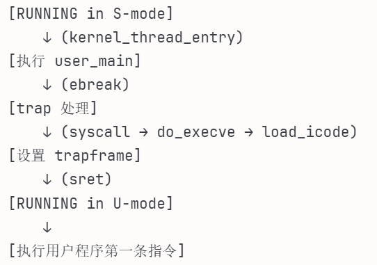

# 练习2

创建子进程的函数`do_fork`在执行中将拷贝当前进程（即父进程）的用户内存地址空间中的合法内容到新进程中（子进程），完成内存资源的复制。具体是通过`copy_range`函数（位于kern/mm/pmm.c中）实现的，请补充`copy_range`的实现，确保能够正确执行。

请在实验报告中简要说明你的设计实现过程。

### 1 函数原型与参数说明

```plain&#x20;text
int copy_range(pde_t *to, pde_t *from, uintptr_t start,
               uintptr_t end, bool share)
```

* `to`：子进程的页目录表指针

* `from`：父进程的页目录表指针

* `start`：起始虚拟地址

* `end`：结束虚拟地址

* `share`：是否共享的标志（本实现中不使用）

### 2 实现代码分析

以下是完整的 `copy_range` 函数实现：

```sql
int copy_range(pde_t *to, pde_t *from, uintptr_t start, uintptr_t end,
               bool share)
{
    assert(start % PGSIZE == 0 && end % PGSIZE == 0);
    assert(USER_ACCESS(start, end));
    // copy content by page unit.
    do
    {
        // call get_pte to find process A's pte according to the addr start
        pte_t *ptep = get_pte(from, start, 0), *nptep;
        if (ptep == NULL)
        {
            start = ROUNDDOWN(start + PTSIZE, PTSIZE);
            continue;
        }
        // call get_pte to find process B's pte according to the addr start. If
        // pte is NULL, just alloc a PT
        if (*ptep & PTE_V)
        {
            if ((nptep = get_pte(to, start, 1)) == NULL)
            {
                return -E_NO_MEM;
            }
            uint32_t perm = (*ptep & PTE_USER);
            // get page from ptep
            struct Page *page = pte2page(*ptep);
            // alloc a page for process B
            struct Page *npage = alloc_page();
            assert(page != NULL);
            assert(npage != NULL);
            int ret = 0;
            void *src_kvaddr = page2kva(page);
            void *dst_kvaddr = page2kva(npage);
            memcpy(dst_kvaddr, src_kvaddr, PGSIZE);
            ret = page_insert(to, npage, start, perm);

            assert(ret == 0);
        }
        start += PGSIZE;
    } while (start != 0 && start < end);
    return 0;
}
```

### 3 关键步骤详解

#### 步骤1：获取父进程页表项

`pte_t *ptep = get_pte(from, start, 0);`

* 调用 `get_pte` 函数查找父进程在虚拟地址 `start` 处的页表项

* 第三个参数 `0` 表示如果页表项不存在则不创建

* 如果返回 `NULL`，说明该地址范围无效，跳过整个页表（`PTSIZE`）的范围

#### 步骤2：验证页面有效性

`if (*ptep & PTE_V)`

* 检查页表项的有效位（PTE\_V）

* 只有有效的页面才需要复制

#### 步骤3：获取子进程页表项

`nptep = get_pte(to, start, 1)`

* 为子进程获取或创建页表项

* 第三个参数 `1` 表示如果页表项不存在则创建

* 如果创建失败（内存不足），返回 `-E_NO_MEM`

#### 步骤4：提取权限信息

`uint32_t perm = (*ptep & PTE_USER);`

* 从父进程页表项中提取用户权限位

* 确保子进程继承相同的访问权限

#### 步骤5：获取物理页面

`struct Page *page = pte2page(*ptep);struct Page *npage = alloc_page();`

* `pte2page`：从页表项获取对应的 `Page` 结构

* `alloc_page`：为子进程分配新的物理页面

#### 步骤6：内存复制（核心实现

`void *src_kvaddr = page2kva(page);void *dst_kvaddr = page2kva(npage);memcpy(dst_kvaddr, src_kvaddr, PGSIZE);`

1. `page2kva`：将 `Page` 结构转换为内核虚拟地址

2. `memcpy`：复制整个页面（`PGSIZE = 4096` 字节）

3. 这里使用了内核虚拟地址进行复制，因为内核可以访问所有物理内存

#### 步骤7：建立映射

`ret = page_insert(to, npage, start, perm);`

* 调用 `page_insert` 建立子进程页表到新物理页面的映射

* 使用从父进程继承的权限位 `perm`

* 如果映射失败，会返回错误码

# 练习3

### fork函数

```c++
static int
sys_fork(uint64_t arg[]) {
    struct trapframe *tf = current->tf;
    uintptr_t stack = tf->gpr.sp;
    return do_fork(0, stack, tf);
}
```

sys\_fork函数调用do\_fork函数。do\_fork函数如下所示：

```c++
int do_fork(uint32_t clone_flags, uintptr_t stack, struct trapframe *tf)
{
    int ret = -E_NO_FREE_PROC;
    struct proc_struct *proc;
    if (nr_process >= MAX_PROCESS)
    {
        goto fork_out;
    }
    ret = -E_NO_MEM;

    // 1. call alloc_proc to allocate a proc_struct
    if ((proc = alloc_proc()) == NULL) {
        goto fork_out;
    }
    // LAB5: update step 1
    // 设置子进程的父进程为 current，并保证当前进程 wait_state 为 0
    proc->parent = current;
    current->wait_state = 0;

    // 2. call setup_kstack to allocate a kernel stack for child process
    if (setup_kstack(proc) != 0) {
        goto bad_fork_cleanup_proc;
    }

    // 3. call copy_mm to dup OR share mm according clone_flag
    if (copy_mm(clone_flags, proc) != 0) {
        goto bad_fork_cleanup_kstack;
    }

    // 4. call copy_thread to setup tf & context in proc_struct
    copy_thread(proc, stack, tf);

    // 5. insert proc_struct into hash_list && proc_list, set the relation links of process
    proc->pid = get_pid();      // 先分配唯一 pid
    hash_proc(proc);            // 加入 hash_list
    set_links(proc);            // LAB5: 使用 set_links 建立父子/兄弟关系并加入 proc_list

    // 6. call wakeup_proc to make the new child process RUNNABLE
    wakeup_proc(proc);

    // 7. set ret value using child proc's pid
    ret = proc->pid;

fork_out:
    return ret;

bad_fork_cleanup_kstack:
    put_kstack(proc);
bad_fork_cleanup_proc:
    kfree(proc);
    goto fork_out;
}
```

首先，为该进程的父进程赋值为当前的进程，setup\_kstack完成了内核栈空间的分配；copy\_mm完成了分配新的虚拟内存或与其他线程共享虚拟内存；copy\_thread获取了原线程的上下文与中断帧，并且设置了当前线程的上下文与中断帧；然后，为新进程获取新的pid进程号，并且赋值给该进程。然后将新线程插入哈希表和链表中，唤醒该新建的进程，返回该进程的pid号。

### exec函数

```c++
static int
sys_exec(uint64_t arg[]) {
    const char *name = (const char *)arg[0];
    size_t len = (size_t)arg[1];
    unsigned char *binary = (unsigned char *)arg[2];
    size_t size = (size_t)arg[3];
    return do_execve(name, len, binary, size);
}
```

sys\_exec函数调用了do\_execve函数。do\_execve函数如下所示：

```c
int do_execve(const char *name, size_t len, unsigned char *binary, size_t size)
{
    struct mm_struct *mm = current->mm;
    if (!user_mem_check(mm, (uintptr_t)name, len, 0))
    {
        return -E_INVAL;
    }
    if (len > PROC_NAME_LEN)
    {
        len = PROC_NAME_LEN;
    }

    char local_name[PROC_NAME_LEN + 1];
    memset(local_name, 0, sizeof(local_name));
    memcpy(local_name, name, len);

    if (mm != NULL)
    {
        cputs("mm != NULL");
        lsatp(boot_pgdir_pa);
        if (mm_count_dec(mm) == 0)
        {
            exit_mmap(mm);
            put_pgdir(mm);
            mm_destroy(mm);
        }
        current->mm = NULL;
    }
    int ret;
    if ((ret = load_icode(binary, size)) != 0)
    {
        goto execve_exit;
    }
    set_proc_name(current, local_name);
    return 0;

execve_exit:
    do_exit(ret);
    panic("already exit: %e.\n", ret);
}
```

该函数用于创建用户空间，加载用户程序。完成了当前线程的虚拟内存空间的回收，以及为当前线程分配新的虚拟内存空间，并加载了应用程序。

### wait函数

```c++
static int
sys_wait(uint64_t arg[]) {
    int pid = (int)arg[0];
    int *store = (int *)arg[1];
    return do_wait(pid, store);
}
```

sys\_wait函数调用了do\_wait函数。do\_wait函数如下所示：

```c
int do_wait(int pid, int *code_store)
{
    struct mm_struct *mm = current->mm;
    if (code_store != NULL)
    {
        if (!user_mem_check(mm, (uintptr_t)code_store, sizeof(int), 1))
        {
            return -E_INVAL;
        }
    }

    struct proc_struct *proc;
    bool intr_flag, haskid;
repeat:
    haskid = 0;
    if (pid != 0)
    {
        proc = find_proc(pid);
        if (proc != NULL && proc->parent == current)
        {
            haskid = 1;
            if (proc->state == PROC_ZOMBIE)
            {
                goto found;
            }
        }
    }
    else
    {
        proc = current->cptr;
        for (; proc != NULL; proc = proc->optr)
        {
            haskid = 1;
            if (proc->state == PROC_ZOMBIE)
            {
                goto found;
            }
        }
    }
    if (haskid)
    {
        current->state = PROC_SLEEPING;
        current->wait_state = WT_CHILD;
        schedule();
        if (current->flags & PF_EXITING)
        {
            do_exit(-E_KILLED);
        }
        goto repeat;
    }
    return -E_BAD_PROC;

found:
    if (proc == idleproc || proc == initproc)
    {
        panic("wait idleproc or initproc.\n");
    }
    if (code_store != NULL)
    {
        *code_store = proc->exit_code;
    }
    local_intr_save(intr_flag);
    {
        unhash_proc(proc);
        remove_links(proc);
    }
    local_intr_restore(intr_flag);
    put_kstack(proc);
    kfree(proc);
    return 0;
}

```

首先，查找状态为PROC\_ZOMBIE的子线程；如果找到了，就将线程从哈希表和链表中删除，最后释放线程的资源。如果查询到拥有子线程的线程，则设置线程状态并切换线程；如果线程已退出，则调用do\_exit函数。

### exit函数

```c++
static int
sys_exit(uint64_t arg[]) {
    int error_code = (int)arg[0];
    return do_exit(error_code);
}
```

sys\_exit函数调用了do\_exit函数。do\_exit函数函数如下所示：

```sql
int do_exit(int error_code)
{
    if (current == idleproc)
    {
        panic("idleproc exit.\n");
    }
    if (current == initproc)
    {
        panic("initproc exit.\n");
    }
    struct mm_struct *mm = current->mm;
    if (mm != NULL)
    {
        lsatp(boot_pgdir_pa);
        if (mm_count_dec(mm) == 0)
        {
            exit_mmap(mm);
            put_pgdir(mm);
            mm_destroy(mm);
        }
        current->mm = NULL;
    }
    current->state = PROC_ZOMBIE;
    current->exit_code = error_code;
    bool intr_flag;
    struct proc_struct *proc;
    local_intr_save(intr_flag);
    {
        proc = current->parent;
        if (proc->wait_state == WT_CHILD)
        {
            wakeup_proc(proc);
        }
        while (current->cptr != NULL)
        {
            proc = current->cptr;
            current->cptr = proc->optr;

            proc->yptr = NULL;
            if ((proc->optr = initproc->cptr) != NULL)
            {
                initproc->cptr->yptr = proc;
            }
            proc->parent = initproc;
            initproc->cptr = proc;
            if (proc->state == PROC_ZOMBIE)
            {
                if (initproc->wait_state == WT_CHILD)
                {
                    wakeup_proc(initproc);
                }
            }
        }
    }
    local_intr_restore(intr_flag);
    schedule();
    panic("do_exit will not return!! %d.\n", current->pid);
}

```

* 如果当前线程的虚拟内存没有用于其他线程，则销毁该虚拟内存

* 如果用于其他的线程了，就将当前线程状态设为PROC\_ZOMBIE，唤醒该线程的父线程

* 完成exit后，调用schedule切换到其他线程

### 请分析fork/exec/wait/exit的执行流程。重点关注哪些操作是在用户态完成，哪些是在内核态完成？内核态与用户态程序是如何交错执行的？内核态执行结果是如何返回给用户程序的？

* 系统调用的部分在内核态进行，用户程序的执行在用户态进行；

* 内核态通过系统调用结束后的sret指令来切换到用户态，用户态通过发起系统调用来产生ebreak异常，从而切换到内核态；

* 内核态执行的结果通过kernel\_execve\_ret函数将中断帧添加到线程的内核栈中，从而将结果返回给用户。

### 生命周期图

生命周期图如下所示：

执行状态：start，PROC\_UNINIT，PROC\_RUNNABLE，PROC\_ZOMBIE，PROC\_SLEEPING等

函数调用：do\_wait，alloc\_proc，do\_fork，wakeup\_proc，wake\_up，do\_exit等

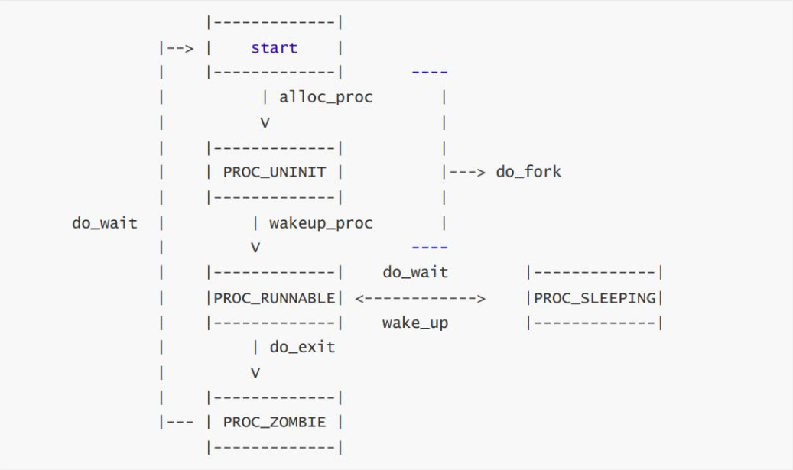

### 实验结果

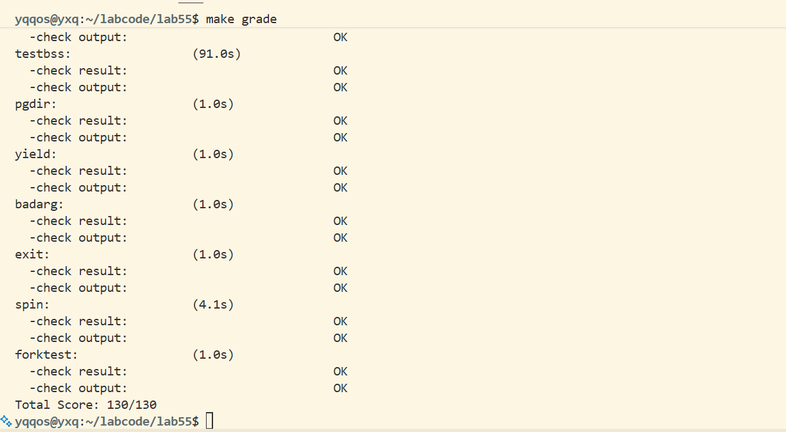

# Challenge

## 1.实现 Copy on Write （COW）机制

### 一、COW机制原理

Copy-on-Write (COW) 是一种推迟内存复制的优化策略。其核心思想是：**共享读，写时复制**。

#### **1 .状态机模型**

物理页面的状态转换可以用有限状态自动机（FSM）来描述：

&#x20;**Exclusive (Writable)**: 页面由单个进程独占，且可读写。

* `page_ref = 1`

* &#x20;PTE 权限: `PTE_R | PTE_W`

**Shared (Read-Only)**: 页面由多个进程共享（父子进程），只读。

* `page_ref > 1`

* PTE 权限: `PTE_R` (无 `PTE_W`)

#### **2 .转换事件**

* **Fork**: 父进程的 **Exclusive&#x20;**&#x9875;面转变&#x4E3A;**&#x20;Shared**，子进程映射同一物理页，双方 PTE 均设为只读。

* **Write Fault**: 进程尝试写入**Shared**页面，触发缺页异常。内核分配新页，复制内容，将当前进程的 PTE 指向新页并设为**Exclusive** (可写)。

### 二、代码实现

1. 首先在 mmu.h 定义了 PTE\_COW（软件位），用于标记共享的写时拷贝页

```c
#define PTE_COW 0x100  // Copy-on-write, use a software-reserved bit
```

* dup\_mmap 将可写 VMA 设为共享模式进入 COW。

```c
 bool share = (vma->vm_flags & VM_WRITE) != 0; // writable regions use COW
```

* 在 copy\_range 的共享路径中，不复制物理页，父子 PTE 统一设为只读+PTE\_COW，共享同一物理页。

```c
if(share){
    // 物理页面共享，标记为只读 + COW
    perm = (perm | PTE_COW) & ~PTE_W;
    page_insert(from, page, start, perm);
    ret = page_insert(to, page, start, perm);
}
```

* 辅助函数：vma\_perm\_to\_pte

```c++
static inline uint32_t
vma_perm_to_pte(uint32_t vm_flags)
{
    uint32_t perm = PTE_U | PTE_V;
    if (vm_flags & VM_READ)
        perm |= PTE_R;
    if (vm_flags & VM_WRITE)
        perm |= (PTE_W | PTE_R);
    if (vm_flags & VM_EXEC)
        perm |= PTE_X;
    return perm;
}
```

此函数负责将 VMA 到 PTE 权限映射，VMA 是逻辑权限，PTE 是实际页表权限。

* 处理 **虚拟内存访问导致的 page fault**

```go
case CAUSE_STORE_PAGE_FAULT:
    ret = do_pgfault(current->mm, tf->cause, tf->tval);
    if (ret != 0)
    {
        cprintf("do_pgfault failed: ret %d, va 0x%lx, epc 0x%lx\n", ret, tf->tval, tf->epc);
        if (trap_in_kernel(tf))
        {
            panic("page fault in kernel\n");
        }
        do_exit(ret);
    }
    break;
```

`do_pgfault` 是 COW 机制的执行者。当进程尝试写入只读的共享页面时，CPU 触发`CAUSE_STORE_PAGE_FAULT`。然后我们进一步调用`do_pgfault`函数进行页故障处理。

* do\_pgfault 首先找 VMA，地址不合法直接返回 -E\_KILLED。随后按 fault 类型检查 VMA 权限，不符则返回 -E\_KILLED。

* 如果 PTE 已存在且带 PTE\_COW 且此次是写故障：

  * 如果该物理页 page\_ref > 1，分配新页、拷贝内容、用 page\_insert 映射新页，权限为可写、去掉 PTE\_COW。

  * 如果引用为 1，直接在原 PTE 上加回 PTE\_W、去掉 PTE\_COW，并 tlb\_invalidate。

* 如果 PTE 未映射，按 VMA 权限分配新页、清零并插入映射。

```c++
int do_pgfault(struct mm_struct *mm, uint32_t error_code, uintptr_t addr)
{
    pgfault_num++;
    uintptr_t fault_addr = ROUNDDOWN(addr, PGSIZE);// 页对齐的缺页地址

    struct vma_struct *vma = find_vma(mm, fault_addr);// 找到对应的 VMA
    if (vma == NULL || fault_addr < vma->vm_start)
    {
        // 非法地址访问，视为致命错误
        return -E_KILLED;
    }

    bool is_store = (error_code == CAUSE_STORE_PAGE_FAULT);// 是否为写操作导致的缺页
    bool is_exec = (error_code == CAUSE_FETCH_PAGE_FAULT);// 是否为执行操作导致的缺页

    // 权限检查：非法访问直接返回错误，由上层终止进程
    // 写操作但 VMA 不可写
    if (is_store && !(vma->vm_flags & VM_WRITE))
    {
        return -E_KILLED;
    }
    // 读操作但 VMA 不可读
    if (!is_store && !is_exec && !(vma->vm_flags & VM_READ))
    {
        return -E_KILLED;
    }
    // 执行操作但 VMA 不可执行
    if (is_exec && !(vma->vm_flags & VM_EXEC))
    {
        return -E_KILLED;
    }

    uint32_t perm = vma_perm_to_pte(vma->vm_flags);// 根据 VMA 标志转换为 PTE 权限位
    pte_t *ptep = get_pte(mm->pgdir, fault_addr, 1);// 获取缺页地址对应的 PTE
    if (ptep == NULL)// 获取 PTE 失败
    {
        return -E_NO_MEM;
    }

    if (*ptep & PTE_V)// 已映射
    {
        if (is_store && (*ptep & PTE_COW))// COW 写操作
        {
            struct Page *page = pte2page(*ptep);// 获取对应的物理页
            if (page_ref(page) > 1)// 共享的物理页
            {
                struct Page *npage = alloc_page();
                if (npage == NULL)// 分配新物理页失败
                {
                    return -E_NO_MEM;
                }
                memcpy(page2kva(npage), page2kva(page), PGSIZE);//把原来共享的物理页内容，复制到新分配的物理页
                page_insert(mm->pgdir, npage, fault_addr, (perm | PTE_W) & ~PTE_COW);//将新的物理页（npage）插入当前进程的页表中，并设置正确权限。
            }
            else
            {
                *ptep = (*ptep | PTE_W) & ~PTE_COW;
                tlb_invalidate(mm->pgdir, fault_addr);//刷新 TLB
            }
            return 0;
        }
        // 已映射但非 COW 的写或执行/读权限不足，视为非法
        if ((is_store && !(perm & PTE_W)) || (is_exec && !(perm & PTE_X)) || (!is_store && !is_exec && !(perm & PTE_R)))
        {
            return -E_KILLED;
        }
        return 0;
    }

    struct Page *page = alloc_page();
    if (page == NULL)
    {
        return -E_NO_MEM;
    }
    if (page_insert(mm->pgdir, page, fault_addr, perm) != 0)// 插入新页表项
    {
        free_page(page);
        return -E_NO_MEM;
    }
    memset(page2kva(page), 0, PGSIZE);// 新页清零
    return 0;
}
```

### 三、**Dirty COW 漏洞原理**

#### **1 .漏洞概述**

Dirty COW (CVE-2016-5195) 是 Linux 内核历史上最严重的提权漏洞之一。它利用了内核在处理 COW 时的竞态条件，允许攻击者写入只读内存映射（如 `/etc/passwd` 的映射）。

#### **2 .漏洞成因**

在 Linux 中，COW 操作涉及多个步骤（解锁 -> 复制 -> 加锁 -> 替换 PTE）。攻击者利用 `madvise(MADV_DONTNEED)` 在这些步骤之间清空页表，导致内核在重试时错误地直接写入了原始的物理页（即磁盘上的只读文件），而不是写入新分配的副本。

#### **3 .ucore 中的潜在风险**

虽然 ucore 没有 `madvise`，但存在类似的逻辑漏洞：

1\.  **权限检查缺失**：如果 \`do\_pgfault\` 忽略了 VMA 的权限检查，直接为只读 VMA 执行 COW，攻击者就能获得代码段的写权限。

2\.  **并发锁竞争**：\`fork\` 过程持有 \`mm\_lock\`，如果此时发生缺页且处理不当，可能导致死锁或状态不一致。

#### **4 .测试用例设计**

为了验证系统的安全性，我们设计了 `user/poc_suite.c` 测试套件。

测试方法：将proc.c第939行的KERNEL\_EXECVE(exit)改为poc\_suite即可测试。

1\.  **Code Write (代码段写入)**:

* 原理：获取 `main` 函数地址，尝试写入。

* 预期：内核应检测到 VMA 为只读，杀死进程。

```c++
void test_code_write() {
    cprintf("TEST: Code Segment Write\n");
    volatile unsigned char *addr = (unsigned char *)main;
    cprintf("Attempting to write to %p\n", addr);
    *addr = 0xCC; 
    cprintf("FAIL: Survived code write!\n");
    exit(0);
}
```

2\.  **Rodata Write (只读数据写入)**:

* 原理：尝试写入 `const` 字符串。

* 预期：内核杀死进程。

```c++
void test_rodata_write() {
    cprintf("TEST: Read-Only Data Write\n");
    const char *msg = "This is read-only data";
    volatile char *addr = (char *)msg;
    cprintf("Attempting to write to %p\n", addr);
    *addr = 'X';
    cprintf("FAIL: Survived rodata write!\n");
    exit(0);
}
```

3\.  **Kernel Write (内核空间写入)**:

* 原理：尝试写入 `KERNBASE` 以上地址。

* 预期：内核杀死进程。

```c++
void test_kernel_write() {
    cprintf("TEST: Kernel Memory Write\n");
    // KERNBASE for RISC-V 64 in ucore
    volatile char *addr = (char *)0xFFFFFFFFC0200000; 
    cprintf("Attempting to write to %p\n", addr);
    *addr = 'X';
    cprintf("FAIL: Survived kernel write!\n");
    exit(0);
}
```

4\.  **Fork Race (并发压力测试)**:

* 原理：创建 20 个子进程，同时写入共享的大数组。

* 预期：所有子进程正确触发 COW，数据互不干扰，无内核崩溃。

```c++
#define N_CHILDREN 20
#define ARRAY_SIZE 4096
int shared_data[ARRAY_SIZE];

void test_fork_race() {
    cprintf("TEST: COW Fork Race (Stress Test)\n");
    
    int i, pid;
    for (i = 0; i < ARRAY_SIZE; i++) shared_data[i] = 0;
    
    for (i = 0; i < N_CHILDREN; i++) {
        pid = fork();
        if (pid == 0) {
            int j;
            for (j = 0; j < ARRAY_SIZE; j++) shared_data[j] = i + 1;
            for (j = 0; j < ARRAY_SIZE; j++) {
                if (shared_data[j] != i + 1) exit(1);
            }
            exit(0);
        }
    }
    
    int status;
    int failed = 0;
    for (i = 0; i < N_CHILDREN; i++) {
        if (waitpid(0, &status) != 0 || status != 0) failed = 1;
    }
    
    if (failed) {
        cprintf("FAIL: Fork race test failed\n");
        exit(1);
    } else {
        cprintf("PASS: Fork race test passed\n");
        exit(0);
    }
}
```

#### 5 .测试结果


代码段写入、只读段写入、内核写入线程均被杀死，并发压力测试所有子进程正确触发 COW，数据互不干扰，无内核崩溃，所有测试均通过！

## 2.说明该用户程序是何时被预先加载到内存中的？与我们常用操作系统的加载有何区别，原因是什么？

**用户程序的加载方式：**

在ucore的实现中，程序在do\_execve函数中被显式加载到内存。调用load\_icode函数，依次将ELF文件的文件头、程序头、程序段内容按页加载到内存空间中。在程序执行之前，所有需要的内容都已经加载到了内存中。

**常见操作系统的加载方式：**

传统操作系统广泛使用懒加载（Lazy Loading）机制，在execve中，只会加载文件头、程序头表，并分配内存区域，但此时并不会将程序段内容（代码段、数据段等）加载过来。当程序开始执行时，以“按需加载”的方式，访问到某个虚拟地址时，若还没映射到物理地址，会通过缺页异常，从磁盘加载对应的页面内容，并更新页表。

**为什么采用这种方式？**

1. 简化设计：无需实现文件系统即可运行用户程序

2. 教学目的：聚焦进程管理、内存管理等核心机制

3. 实验环境：嵌入式/教学系统，程序集合固定且较小

4. 启动速度：程序已在内存，无需磁盘 I/O

# lab2分支任务：页表查询过程

## 一、实验流程

本次实验需要三个终端来操作：

* **终端1：启动QEMU模拟器**
  &#x20;执行`make debug`启动QEMU模拟器并暂停在初始状态。

* **终端2：附加到QEMU进程**
  &#x20;获取QEMU进程的PID，并使用GDB附加到QEMU进程。通过单步执行QEMU代码，观察MMU如何处理虚拟地址到物理地址的转换。

* **终端3：调试ucore内核**
  &#x20;在终端3中启动`make gdb`，并在内核中设置断点，观察ucore内核的访存指令如何触发QEMU中的页表查找和TLB查询。

具体操作步骤：

终端1

```plain&#x20;text
make debug
```

终端2

```plain&#x20;text
pgrep -f qemu-system-riscv64
sudo gdb
attach pid
handle SIGPIPE nostop noprint
c
```

终端3

```plain&#x20;text
make gdb
set remotetimeout unlimited
b kern_init
c
```


参照指导书上的提示，我们可以先在kern\_init打上断点，因为我们知道一定会调到这个函数。当执行到这个函数时gdb会停下，此时我们使用

```plain&#x20;text
x/8i $pc
```

这个命令，来观察下面将要执行的指令，在这些指令里面来寻找访存指令，于是我们就可以直接跳到这个访存指令来进行观察，这样比自己一步一步找要简便。

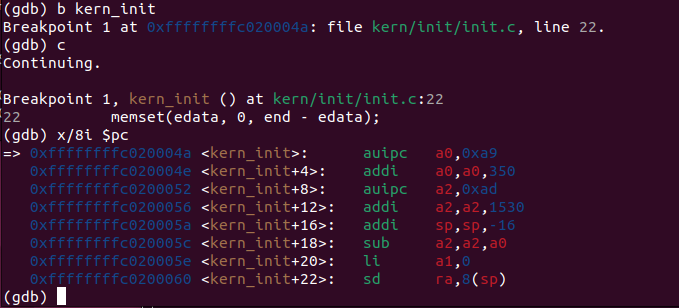

我们可以看到最后有一个sd指令，在这里会进行地址转换：

于是我们使用si进行单步调试，直到进入最后一个指令，这时我们在终端2进行下一步：

```plain&#x20;text
^C
b get_physical_address

```

然后一直进行c操作，gdb会在这个函数停下，我们每停一次检查一次地址：`p/x addr`

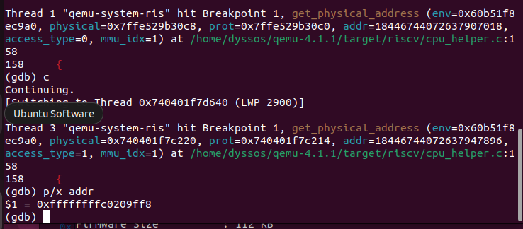

此时两个终端的状态分别为：

终端3：

```bash
(gdb) b get_physical_address
Breakpoint 1 at 0x5cb3aef8dbb5: file /home/dyssos/qemu-4.1.1/target/riscv/cpu_helper.c, line 158.
(gdb) c
Continuing.

Thread 1 "qemu-system-ris" hit Breakpoint 1, get_physical_address (env=0x5cb3cde729a0, physical=0x7ffe4e7bb028, prot=0x7ffe4e7bb020, addr=18446744072637907018, access_type=0, mmu_idx=1) at /home/dyssos/qemu-4.1.1/target/riscv/cpu_helper.c:158
158        {
(gdb) p/x addr
$1 = 0xffffffffc020004a
(gdb) c
Continuing.
[Switching to Thread 0x72ae6ffff640 (LWP 2907)]

Thread 3 "qemu-system-ris" hit Breakpoint 1, get_physical_address (env=0x5cb3cde729a0, physical=0x72ae6fffe220, prot=0x72ae6fffe214, addr=18446744072637947896, access_type=1, mmu_idx=1) at /home/dyssos/qemu-4.1.1/target/riscv/cpu_helper.c:158
158        {
(gdb) p/x addr
$2 = 0xffffffffc0209ff8
(gdb) c
Continuing.
[Switching to Thread 0x72ae76f28b00 (LWP 2905)]

Thread 1 "qemu-system-ris" hit Breakpoint 1, get_physical_address (env=0x5cb3cde729a0, physical=0x7ffe4e7bb068, prot=0x7ffe4e7bb060, addr=18446744072637943808, access_type=0, mmu_idx=1) at /home/dyssos/qemu-4.1.1/target/riscv/cpu_helper.c:158
158        {
(gdb) p/x addr
$3 = 0xffffffffc0209000
(gdb) c
Continuing.

Thread 1 "qemu-system-ris" hit Breakpoint 1, get_physical_address (env=0x5cb3cde729a0, physical=0x7ffe4e7bb008, prot=0x7ffe4e7bb000, addr=18446744072637907018, access_type=0, mmu_idx=1) at /home/dyssos/qemu-4.1.1/target/riscv/cpu_helper.c:158
158        {
(gdb) p/x addr
$4 = 0xffffffffc020004a
(gdb) c
Continuing.

```

终端2：

```plain&#x20;text
(gdb) si
0xffffffffc020004e        22            memset(edata, 0, end - edata);
(gdb) 
0xffffffffc0200052        22            memset(edata, 0, end - edata);
(gdb) 
0xffffffffc0200056        22            memset(edata, 0, end - edata);
(gdb) 
0xffffffffc020005a        20        {
(gdb) 
0xffffffffc020005c        22            memset(edata, 0, end - edata);
(gdb) 
0xffffffffc020005e        22            memset(edata, 0, end - edata);
(gdb) 
0xffffffffc0200060        20        {
(gdb) 
0xffffffffc0200062        22            memset(edata, 0, end - edata);
(gdb) 

```

可以看到终端2成功进入到下一步，这时我们看看地址是哪里`i r sp`：

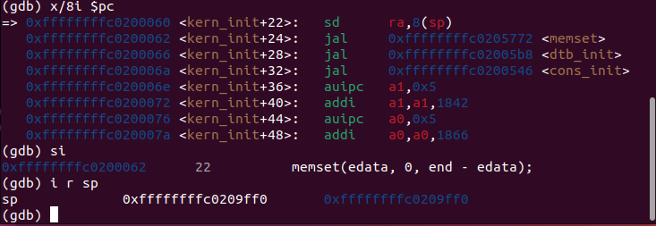

我们可以看到此时的地址是：`0xffffffffc0209ff0`，对应之前的指令来看：`sd        ra,8(sp)`，我们在终端3触发的多个断点，只有第二个是对应上的：

```plain&#x20;text
Thread 3 "qemu-system-ris" hit Breakpoint 1, get_physical_address (env=0x5cb3cde729a0, physical=0x72ae6fffe220, prot=0x72ae6fffe214, addr=18446744072637947896, access_type=1, mmu_idx=1) at /home/dyssos/qemu-4.1.1/target/riscv/cpu_helper.c:158
158        {
(gdb) p/x addr
$2 = 0xffffffffc0209ff8
(gdb) c
```

于是我们回过头重新执行这一遍流程，看在第二个断点触发时，它的调用链，tlb等等......

首先我们使用bt命令来看它的调用链是怎么样的：

```bash
(gdb) p/x addr
$2 = 0xffffffffc0209ff8
(gdb) bt
#0  get_physical_address (env=0x641dd3ea09a0, physical=0x754501306220, 
    prot=0x754501306214, addr=18446744072637947896, access_type=1, mmu_idx=1)
    at /home/dyssos/qemu-4.1.1/target/riscv/cpu_helper.c:158
#1  0x0000641dc409d891 in riscv_cpu_tlb_fill (cs=0x641dd3e97f90, 
    address=18446744072637947896, size=8, access_type=MMU_DATA_STORE, 
    mmu_idx=1, probe=false, retaddr=128939112530245)
    at /home/dyssos/qemu-4.1.1/target/riscv/cpu_helper.c:451
#2  0x0000641dc3fe3b0f in tlb_fill (cpu=0x641dd3e97f90, 
    addr=18446744072637947896, size=8, access_type=MMU_DATA_STORE, mmu_idx=1, 
    retaddr=128939112530245) at /home/dyssos/qemu-4.1.1/accel/tcg/cputlb.c:878
#3  0x0000641dc3fea01e in store_helper (big_endian=false, size=8, 
    retaddr=128939112530245, oi=49, val=2147486210, addr=18446744072637947896, 
    env=0x641dd3ea09a0) at /home/dyssos/qemu-4.1.1/accel/tcg/cputlb.c:1522
#4  helper_le_stq_mmu (env=0x641dd3ea09a0, addr=18446744072637947896, 
    val=2147486210, oi=49, retaddr=128939112530245)
    at /home/dyssos/qemu-4.1.1/accel/tcg/cputlb.c:1672
#5  0x00007544fa000145 in code_gen_buffer ()
#6  0x0000641dc400873b in cpu_tb_exec (cpu=0x641dd3e97f90, 
    itb=0x7544fa000040 <code_gen_buffer+19>)
    at /home/dyssos/qemu-4.1.1/accel/tcg/cpu-exec.c:173
#7  0x0000641dc4009581 in cpu_loop_exec_tb (cpu=0x641dd3e97f90, 
    tb=0x7544fa000040 <code_gen_buffer+19>, last_tb=0x754501306918, 
    tb_exit=0x754501306910) at /home/dyssos/qemu-4.1.1/accel/tcg/cpu-exec.c:621
```

在这个调用链我们可以看到：

调用栈显示发生了 TLB miss，执行路径进入：

* `tlb_fill(...)`（/accel/tcg/cputlb.c）

* `riscv_cpu_tlb_fill(...)`

* `get_physical_address(...)`（/target/riscv/cpu\_helper.c）

同时，此次访存是数据写入（store），地址为：

* `addr = 0xffffffffc0209ff8`

* `access_type = MMU_DATA_STORE`

* `mmu_idx = 1`

**分析结论：**
当访问虚拟地址 `0xffffffffc0209ff8` 进行写操作时未命中 TLB，因此 QEMU 进入 `tlb_fill → get_physical_address` 的页表遍历路径，用于查表并回填 TLB。

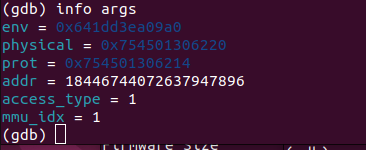

上图是在观察所有参数。

然后我们进行单步执行：`n`，并且设置观察点：

```plain&#x20;text
(gdb) display i
(gdb) display idx
(gdb) display base
(gdb) display pte
(gdb) display levels
(gdb) display ptshift
```

在单步执行中，我们看到mode 成功变成1，即当前是Supervisor模式（S模式），不是Machine模式（PRV\_M=3）。

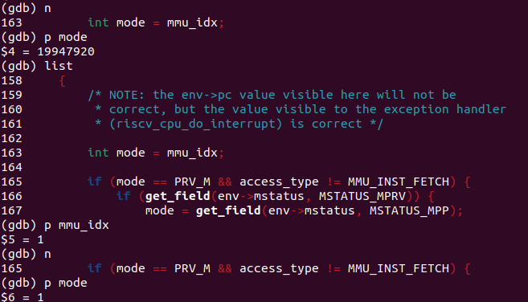

然后继续单步执行，观察后续操作：

首先我们既然通过调用链看到tlb确实miss了，于是我们接下来几步重点观察一下tlb相关函数：

**步骤 1：在 TLB 写入函数处下断点，捕获“TLB 被写入”的瞬间**

**命令：**

`b tlb_set_page
b tlb_set_page_with_attrs
c`

```bash
(gdb) b tlb_set_page
Breakpoint 2 at 0x59d5db333a04: file /home/dyssos/qemu-4.1.1/accel/tcg/cputlb.c, line 847.
(gdb) b tlb_set_page_with_attrs
Breakpoint 3 at 0x59d5db3334b3: file /home/dyssos/qemu-4.1.1/accel/tcg/cputlb.c, line 700.
(gdb) b tlb_set_page_full
Function "tlb_set_page_full" not defined.
Make breakpoint pending on future shared library load? (y or [n]) n
(gdb) c
Continuing.

Thread 3 "qemu-system-ris" hit Breakpoint 2, tlb_set_page (cpu=0x59d60d6d6f90, vaddr=18446744072637943808, paddr=2149617664, prot=7, mmu_idx=1, size=4096) at /home/dyssos/qemu-4.1.1/accel/tcg/cputlb.c:847
847            tlb_set_page_with_attrs(cpu, vaddr, paddr, MEMTXATTRS_UNSPECIFIED,
```

**观测结果：**
&#x20;命中 `tlb_set_page(...)`，参数显示）：

* `mmu_idx=1`

* `size=4096`

* `prot=7`

* `vaddr=18446744072637943808`

* `paddr=2149617664` data store 走的那套 MMU index

上面的数看着很奇怪，问了ai之后发现没转16进制，转完之后即为：

`vaddr = 0xffffffffc0209000`

`paddr = 0x80209000`

`size = 4096 (0x1000)` → **4KB 页**

`prot = 7`（在 QEMU 里是 R/W/X 三个位相或：1|2|4=7）→ **RWX 都允许**

`mmu_idx = 1`

**分析结论：**
&#x20;已经到达“TLB 回填”的核心阶段：QEMU 将把页表遍历得到的结果写入 TLB。此处 `size=4096` 表明回填粒度为 4KB 页。

这次 `MMU_DATA_STORE` 的访问，最终被翻译成了：

> **VA 页 0xffffffffc0209000 → PA 页 0x80209000**（4KB 映射，权限 RWX）

***

**步骤 2：进入 `tlb_set_page_with_attrs`，计算并验证 VA 页 → PA 页映射**

**命令：**

`s
info args
p/x (vaddr & ~0xfffULL)
p/x (paddr & ~0xfffULL)
p/x (vaddr & 0xfffULL)`

```plain&#x20;text
(gdb) info args
cpu = 0x59d60d6d6f90
vaddr = 18446744072637943808
paddr = 2149617664
attrs = {
  unspecified = 1,
  secure = 0,
  user = 0,
  requester_id = 0,
  target_tlb_bit0 = 0,
  target_tlb_bit1 = 0,
  target_tlb_bit2 = 0
}
prot = 7
mmu_idx = 1
size = 4096
(gdb) p/x (vaddr & ~0xfffULL)
$3 = 0xffffffffc0209000
(gdb) p/x (paddr & ~0xfffULL)
$4 = 0x80209000
(gdb) p/x (vaddr & 0xfffULL)
$5 = 0x0
```

**观测结果：**
&#x20;在 `tlb_set_page_with_attrs(...)` 中得到：

* `vaddr & ~0xfffULL = 0xffffffffc0209000`

* `paddr & ~0xfffULL = 0x80209000`

* `vaddr & 0xfffULL = 0x0`

* `size = 4096`

* `prot = 7`

* `mmu_idx = 1`

且触发 miss 的地址为 `0xffffffffc0209ff8`，它位于页 `0xffffffffc0209000` 内（页内偏移 `0xff8`）。

**分析结论：**
&#x20;TLB 回填写入的映射为：

> **VA 页 `0xffffffffc0209000` → PA 页 `0x80209000`（4KB）**

并且该映射用于数据写路径（`mmu_idx=1`，`MMU_DATA_STORE`），权限组合为 `prot=7`（QEMU 内部权限位组合结果）。


**然后我们就可以进入页表部分了：**

**1、回到 `get_physical_address`，确认当前为 Sv39 三级页表配置**

**命令：**

`在 get_physical_address 中单步到初始化处后：
p levels
p ptidxbits
p ptesize
p/x base`

**观测结果：**
&#x20;打印得到：

* `levels = 3`

* `ptidxbits = 9`

* `ptesize = 8`

* `base = 0x8020a000`

**分析结论：**
&#x20;该组参数对应 **Sv39**：

* 三级页表（levels=3）

* 每级索引 9bit（ptidxbits=9）

* 页表项大小 8 字节（ptesize=8）

* `base=0x8020a000` 为根页表（L2）物理基址（等价于 `satp.ppn << 12`）。

***

**2、执行页表遍历循环，观察索引计算、PTE 读取与权限检查流程**

**命令：**

```plain&#x20;text
关键：ptshift 初始化
int ptshift = (levels - 1) * ptidxbits;
循环体内关键计算
idx = (addr >> (PGSHIFT + ptshift)) & ((1 << ptidxbits) - 1);
pte_addr = base + idx * ptesize;
pte = ldq_phys(cs->as, pte_addr);
ppn = pte >> PTE_PPN_SHIFT;
n  # 多次单步，观察执行到：
- 计算 idx / pte_addr
- 读 pte
- 权限判断（store 需要 PTE_W）
- 返回 TRANSLATE_SUCCESS
```

**观测结果：**

```plain&#x20;text
(gdb) n
223            CPUState *cs = env_cpu(env);
1: mode = 1
2: levels = 3
3: ptshift = 0
4: base = 2149621760
(gdb) p levels
$11 = 3
(gdb) <pre>p ptidxbits</pre>
Undefined command: "<pre>p".  Try "help".
(gdb) p ptidxbits
$12 = 9
(gdb) p ptesize
$13 = 8
(gdb) p/x base
$14 = 0x8020a000
(gdb)  p/x get_field(env->satp, SATP_PPN)
No symbol "get_field" in current context.
(gdb) n
224            int va_bits = PGSHIFT + levels * ptidxbits;
1: mode = 1
2: levels = 3
3: ptshift = 0
4: base = 2149621760
(gdb)  p/x get_field(env->satp, SATP_PPN)
No symbol "get_field" in current context.
(gdb) n
225            target_ulong mask = (1L << (TARGET_LONG_BITS - (va_bits - 1))) - 1;
1: mode = 1
2: levels = 3
3: ptshift = 0
4: base = 2149621760
(gdb) n
226            target_ulong masked_msbs = (addr >> (va_bits - 1)) & mask;
1: mode = 1
2: levels = 3
3: ptshift = 0
4: base = 2149621760
(gdb) n
227            if (masked_msbs != 0 && masked_msbs != mask) {
1: mode = 1
2: levels = 3
3: ptshift = 0
4: base = 2149621760
(gdb) n
231            int ptshift = (levels - 1) * ptidxbits;
1: mode = 1
2: levels = 3
3: ptshift = 0
4: base = 2149621760
(gdb) n
237            for (i = 0; i < levels; i++, ptshift -= ptidxbits) {
1: mode = 1
2: levels = 3
3: ptshift = 18
4: base = 2149621760
(gdb) n
```

* `ptshift` 初始化为 `18`（因为 `(3-1)*9=18`）

* 索引计算使用 `addr >> (PGSHIFT + ptshift)`（即第一次为右移 30 位，对应 VPN2）

* 读取 PTE 后依次判断 `PTE_V`、是否为非叶子项（R/W/X 全为 0）、以及写访问所需 `PTE_W` 等条件

* 条件满足后计算物理地址并 `return TRANSLATE_SUCCESS`

**分析结论：**
`get_physical_address` 完成了标准的 Sv39 页表遍历流程：按 VPN 分级索引页表项、读取 PTE、进行有效位/权限位/对齐约束检查，并在满足写访问权限后生成物理地址与访问权限，最终翻译成功。

***

**3、对比页表翻译结果与 TLB 回填结果，确认一致性**

```yaml
345                    if ((pte & PTE_W) &&
1: mode = 1
2: levels = 3
3: ptshift = 18
4: base = 2149621760
(gdb) n
347                        *prot |= PAGE_WRITE;
1: mode = 1
2: levels = 3
3: ptshift = 18
4: base = 2149621760
(gdb) n
349                    return TRANSLATE_SUCCESS;
```

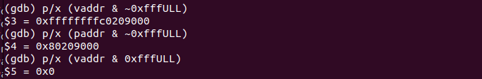

**观测结果：**
&#x20;TLB 回填映射已经明确为：

* `0xffffffffc0209000 → 0x80209000`（4KB）

页表遍历返回成功（`TRANSLATE_SUCCESS`），并将翻译得到的地址/权限用于回填 TLB。

**分析结论：**
&#x20;本次过程形成闭环：

> **TLB miss → get\_physical\_address(Sv39) 页表遍历 → 翻译成功并得到 PA/权限 → tlb\_set\_page\_with\_attrs 回填 TLB**

最终确认：访问 `0xffffffffc0209ff8` 的写操作通过该映射成功翻译，并由 TLB 缓存该页映射以加速后续访问。

## 二、指导书问题回答

## 1）关键调用路径：一次访存指令如何走到 TLB / 页表翻译

#### 1.1 触发的访存指令（Guest 侧：ucore 内核）

在终端 3（调试内核）观察到 `kern_init` 附近有一条访存指令 `sd ra, 8(sp)`，并且当时 `sp = 0xffffffffc0209ff0`，所以这条 store 的虚拟地址就是：
`sp + 8 = 0xffffffffc0209ff8`。

***

#### 1.2 QEMU/TCG 侧的调用链（Host 侧：qemu 源码执行路径）

当这条 `sd` 被 QEMU（TCG 翻译执行）执行时，QEMU 会进入 “MMU 访存 helper → TLB 查找/填充 → 页表遍历” 的链路。用 `bt` 看到的关键调用栈是（自下而上概括）：

`code_gen_buffer()`（TCG 生成的代码）
&#x20;→ `helper_le_stq_mmu()`
&#x20;→ `store_helper()`（在 `accel/tcg/cputlb.c`）
&#x20;→ `tlb_fill()`（在 `accel/tcg/cputlb.c:878`）
&#x20;→ `riscv_cpu_tlb_fill()`（在 `target/riscv/cpu_helper.c`）
&#x20;→ `get_physical_address()`（在 `target/riscv/cpu_helper.c:158`）

其中这次访问参数也非常明确：

* `addr = 0xffffffffc0209ff8`

* `access_type = MMU_DATA_STORE`

* `mmu_idx = 1`&#x20;

***

## 2）路径上的关键分支

#### 2.1 在 `store_helper`：先查 TLB，miss 才会走 `tlb_fill`

从调用栈能看出：`store_helper → tlb_fill`，说明这次访存**没有在 fast path 直接完成**，而是触发了 “TLB miss/需要填充” 的慢路径。

在 QEMU/TCG 里典型逻辑是：

* 先根据 `mmu_idx`、访问类型（store/load/ifetch）、访问大小（8字节）从 **软件 TLB 表**里找 entry

* **命中**：直接把 guest 虚拟地址快速转成 host 可访问地址（或识别 MMIO），完成存储

* **未命中**：调用 `tlb_fill()` 去做“翻译并回填 TLB”，再重试该次访存

我们这次就是走到了 `tlb_fill()`。

***

#### 2.2 在 `get_physical_address`：页表遍历中的关键分支都在“判断 PTE 类型 + 权限”

单步时经过了很多 `else if`，它们基本分成 4 类：

1. **地址合法性（canonical）检查**
   &#x20;对 Sv39 来说，高位必须是符号扩展（否则是“非规范地址”），不符合就直接失败（对应你看到的 `masked_msbs` 检查逻辑）。

2. **PTE 有效性检查：`PTE_V`**
   &#x20;无效项直接 fault。

3. **PTE 类型判断：非叶子（指向下一级） vs 叶子（产生映射）**

* 若 `!(pte & (R|W|X))`：说明这是“页表指针”，需要把 `base` 更新为下一级页表物理地址，继续下一轮循环

* 否则：这是 leaf（叶子项），要进入权限/对齐/访问类型检查并计算物理地址

4. **权限与一致性检查（和 access\_type 绑定）**
   我们这次是 `MMU_DATA_STORE`，必须满足 `pte & PTE_W`，否则就失败；此外还有 U/S 模式、W-only、W+X 等组合的合法性检查。

> 这些分支的意义：保证 QEMU 的翻译行为符合 RISC-V Sv39 的规范（而不是只“算出一个地址”）。

***

## 3）找到“模拟 CPU 查找 TLB”的 C 代码：先查 TLB，miss 才查页表

* `store_helper`（TLB 快路径/慢路径入口）在 `accel/tcg/cputlb.c:1522`&#x20;

* `tlb_fill`（miss 时填充）在 `accel/tcg/cputlb.c:878`&#x20;

* 架构相关的翻译在 `target/riscv/cpu_helper.c`（`riscv_cpu_tlb_fill`、`get_physical_address`）

所以查 TLB 的代码就在：

* `accel/tcg/cputlb.c` 的 `store_helper` / `load_helper` / `tlb_fill` 一套逻辑里

通过断点命中了 `tlb_set_page` / `tlb_set_page_with_attrs`，这就是 TLB miss 后“写入软件 TLB 表”的函数（回填点）。

***

## 4）QEMU 软件 TLB vs 真实 CPU TLB：逻辑差异

**真实 CPU TLB：**

* 硬件结构（组相联/全相联），并行查找，和流水线强耦合

* 有 ASID、global、page size、权限等；命中/未命中带来真实时序差异

* miss 会触发硬件 page-walk 或异常（取决于架构实现/模式）

**QEMU 的软件 TLB（TCG）：**

* 本质是 **QEMU 为了加速仿真在软件里做的 cache**（数据结构在内存里，按 `mmu_idx` 分组）

* entry 里除了“VA→PA”信息，还会缓存“把 guest 地址快速变成 host 地址”的辅助量（比如 addend、iotlb，用于快速访问 host 内存或识别 MMIO）

* 命中/未命中更多是“是否要走一段 C 代码慢路径”，并不等价于真实硬件的周期级行为

***

## 5）调试过程中“抓马/有趣”的细节与学到的知识

1. **同一个断点会被多次触发，地址还不一样**
   &#x20;在 `get_physical_address` 断点处看到地址有 `0xffffffffc020004a`、`0xffffffffc0209ff8`、`0xffffffffc0209000` 等多次出现，说明“内核初始化阶段有很多访存都会走翻译”，必须靠“对应具体指令”（如 `sd ra,8(sp)`）才能锁定目标。

2. **GDB 里 `get_field` 用不了**
   &#x20;因为 `get_field` 是 C 宏，编译后不存在符号，所以 GDB 提示找不到。这是“读源码 vs 调试符号”的典型坑。

3. **变量显示乱值**
   &#x20;在 `tlb_set_page_with_attrs` 里看到一堆看起来离谱的 locals（比如指针不像指针），这在 `-O2` 的 QEMU 上很常见：局部变量可能被寄存器复用/优化掉。正确做法是多看 `info args`、关键计算结果，以及在关键赋值点附近下断点。

4. **“三级页表”并不意味着一定会循环 3 次**
   &#x20;如果高层 PTE 就是 leaf（大页映射），会提前 return；如果是普通 4KB 页，才会走满 3 轮。

***

## 6）实验中“通过大模型解决的问题”

#### 7.1 情景 1：不知道从哪里看 TLB（CPUState 里看不到）

* **问题**：我尝试 `ptype *cpu`，发现 `struct CPUState` 里没有明显 TLB 字段，不知道 TLB 存在哪里，也不知道如何证明“先查 TLB”。

* **我的思路**：换一种能直接观察“写 TLB”的方法，而不是死磕结构体字段。

* **与大模型交互**：我向大模型描述 `bt` 和断点位置，大模型建议直接在 `tlb_set_page` / `tlb_set_page_with_attrs` 下断点抓“TLB 回填瞬间”，从 `info args` 得到 vaddr/paddr/prot/size/mmu\_idx，从而绕过结构体不确定性。

* **结果**：成功观测到 `vaddr_page=0xffffffffc0209000 → paddr_page=0x80209000`、`size=4096`、`prot=7`、`mmu_idx=1`，确认是一次 TLB miss 后的回填。

#### 7.2 情景 2：不理解页表遍历循环与两行代码在干什么

* **问题**：在 `get_physical_address` 单步时看到循环、分支很多，不理解“三级页表到底怎么查”。

* **我的思路**：把每次循环要做的事抽象成两步：算 `pte_addr`、读 `pte`，再判断 leaf/非 leaf。

* **与大模型交互**：我们把单步到的关键行（`idx` 计算、`pte_addr`、`ldq_phys`、权限分支）贴给大模型，大模型用“每轮 = 用 VPN 选中一个 PTE”的视角解释，并指出 `pte_addr = base + idx*8` 与 `ldq_phys` 正是在“从当前页表取出页表项”。

* **结果**：能把复杂的代码路径写成“三级 walk 的标准流程”，并能解释每个分支在验证什么。


# lab5分支任务：GDB系统调用过程细究

这次实验内容咋这么多！小发雷霆一下！

## 一、调试环境

我选择开两个终端进行，终端 A 运行 `make debug` 启动 QEMU 虚拟机，终端 B 运行 `make gdb` 连接到 QEMU 进行调试。由于需要调试用户态程序，需要手动加载用户程序符号表：`add-symbol-file obj/__user_exit.out`。

## 二、系统调用入口（ecall）观察

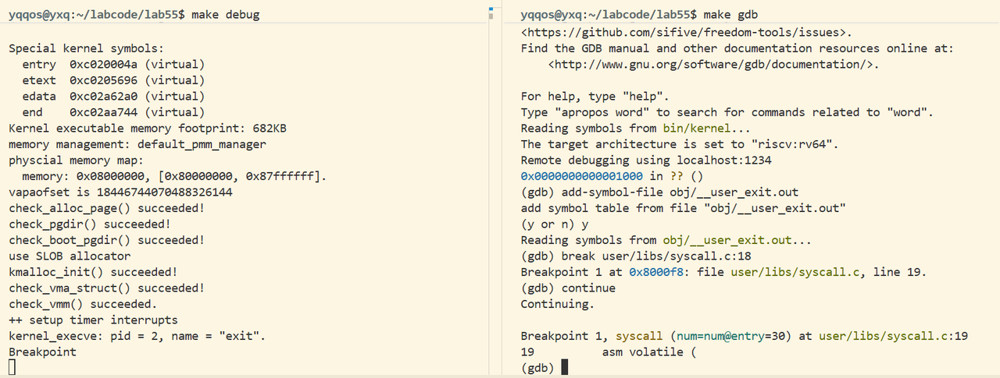

在 `user/libs/syscall.c:18` 设置断点，程序停在系统调用函数入口。通过多次 `si` 单步执行，定位到 `ecall` 指令位置（地址 `0x800104`）。

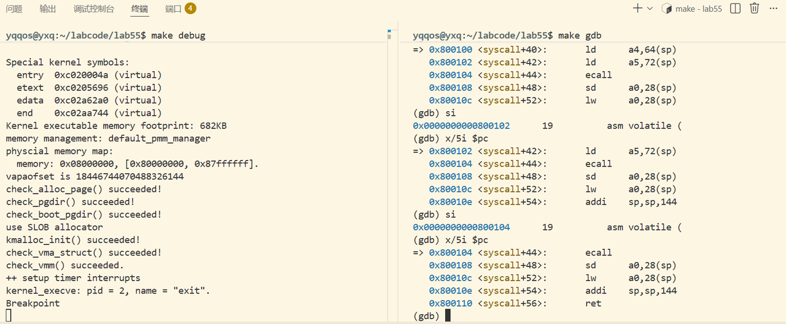

上图显示我们的下一条指令就是ecall，所以我们先记录一下寄存器的状态。

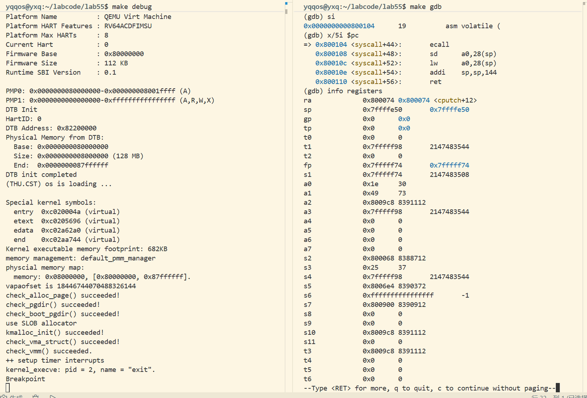

**执行 ecall 前的关键寄存器状态：**

* PC = `0x800104`（用户态地址）

* SP = `0x7fffff74`（用户栈）

* a0 = `0x1e`（30，系统调用号）

* 特权级：U-mode

好的，此时关键寄存器的状态已经保留下来了，继续单步执行（si）

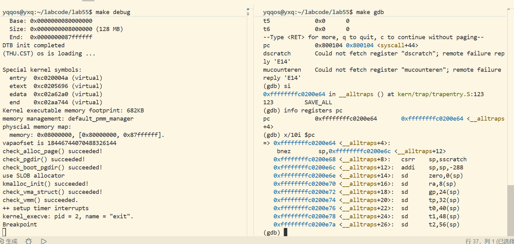

**执行 `ecall` 后，观察到以下变化：**

* PC 跳转到 `0xffffffffc0200e64`（`__alltraps` 入口，内核态地址）

* SP 切换到 `0xffffffffc04b1000`（内核栈）

* 特权级从 U-mode 切换到 S-mode

* CPU 自动保存 `sepc` 寄存器为 `0x800108`（ecall 的下一条指令地址）

* `scause` 被设置为 8（表示来自 U-mode 的环境调用）

**进入 `__alltraps` 后，内核执行 `SAVE_ALL` 宏保存用户态上下文。观察到的关键指令：**

```python
bnez sp, ...              # 检查是否从用户态来
csrr sp, sscratch         # 如果是，从 sscratch 加载内核栈指针
addi sp, sp, -288         # 在内核栈上分配空间
sd ra, 8(sp)              # 保存 ra 寄存器
sd gp, 24(sp)             # 保存 gp 寄存器
...                       # 依次保存所有通用寄存器
```

这个过程就把用户态的所有的寄存器保存到内核栈的trapframe 结构中，为了后续的系统调用保留了现场。

## 三、系统调用返回（sret）观察

接下来就是在`__trapret` 设置断点，程序停在中断返回入口。此时内核已完成系统调用处理，准备返回用户态。

观察到 `RESTORE_ALL` 宏的执行过程，通过一系列 `ld` 指令从内核栈恢复寄存器：

```plain&#x20;text
ld s1, 256(sp)            # 恢复保存的寄存器
ld s2, 264(sp)
...
csrw sstatus, s1          # 恢复状态寄存器
csrw sepc, s2             # 恢复返回地址
ld ra, 8(sp)              # 恢复通用寄存器
...
```

（这里忘记截图了TT）

然后就是通过多次si单步执行（超级多次），定位到了sret指令。

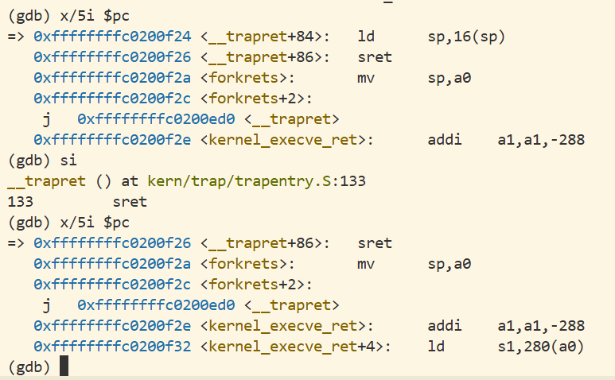

然后我们还是要保存执行sret之前的关键寄存器的状态。

```sql
PC = 0xffffffffc0200eXX（内核态地址）
SP = 0xffffffffc04b1XXX（内核栈）
sepc = 0x800108（保存的返回地址）
特权级：S-mode
```

然后我们在保存了状态之后就可以继续si执行了，然后再查看寄存器的值，发现了如下的变化：

```sql
PC 从 sepc 恢复为 0x800108（syscall 函数的下一条指令）
SP 恢复为用户栈地址 0x7fffffXX
特权级从 S-mode 切换回 U-mode
程序继续在用户态执行
```

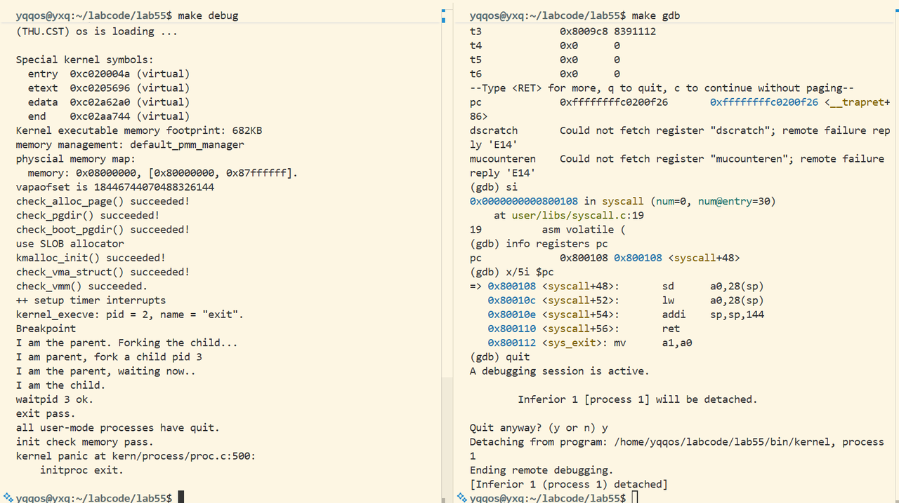

## 四、流程总结

通过 GDB 调试观察到系统调用的完整流程：

1. **用户态触发**：用户程序执行 `ecall` 指令，参数通过 a0-a7 寄存器传递

2. **特权级切换**：硬件自动完成 U-mode → S-mode 切换，PC 跳转到 `stvec` 指向的 `__alltraps`

3. **上下文保存**：内核执行 `SAVE_ALL` 保存用户态所有寄存器到 trapframe

4. **系统调用处理**：内核根据系统调用号执行相应的服务函数

5. **上下文恢复**：执行 `RESTORE_ALL` 从 trapframe 恢复寄存器

6. **返回用户态**：执行 `sret` 指令，硬件自动完成 S-mode → U-mode 切换，从 `sepc` 恢复 PC

整个过程体现了操作系统通过硬件支持的特权级机制实现用户态与内核态的安全隔离，用户程序只能通过受控的系统调用接口获取内核服务。

## 五、问题回答

#### **1.在大模型的帮助下，完成整个调试的流程，观察一下ecall指令和sret指令是如何被qemu处理的，并简单阅读一下调试中涉及到的qemu源码，解释其中的关键流程。**

**1.1 ecall 处理流程：**

* QEMU 在 `target/riscv/cpu_helper.c` 中的 `riscv_cpu_do_interrupt()` 函数捕获 ecall 异常

* 检测到异常类型为 `RISCV_EXCP_U_ECALL`（来自 U-mode 的环境调用）

* 设置 CSR 寄存器：`scause = 8`，`sepc = 当前PC + 4`，`stval = 0`

* 根据当前特权级更新 `sstatus` 寄存器的 SPP 位（保存先前特权级）

* 将 PC 设置为 `stvec` 的值（中断向量表地址）

* 特权级提升为 S-mode

**1.2 ret 处理流程：**

* QEMU 在 `target/riscv/op_helper.c` 中的 `helper_sret()` 函数处理 sret 指令

* 从 `sepc` 恢复 PC 值

* 根据 `sstatus.SPP` 位确定返回的特权级（0 表示返回 U-mode）

* 更新 `sstatus` 寄存器的 SIE 位（恢复中断使能状态）

* 将特权级降低为目标模式

* 清除 `sstatus.SPP` 位

#### **2.在执行ecall和sret这类汇编指令的时候，qemu进行了很关键的一步——指令翻译（TCG Translation），了解一下这个功能，思考一下另一个双重gdb调试的实验是否也涉及到了一些相关的内容。**

**2.1** QEMU 的 TCG（Tiny Code Generator）是将客户机指令（如 RISC-V）翻译为主机指令（如 x86-64）的关键组件。工作流程：

**2.2** 对于 `ecall` 和 `sret`，TCG 会识别这些特殊指令，生成调用 helper 函数的代码（如 `helper_raise_exception`），在 helper 函数中处理特权级切换等复杂操作.

**2.3 与地址翻译调试的关联：** 在 Lab2 的地址翻译调试实验中，QEMU 同样通过 TCG 翻译内存访问指令。当遇到页表查询操作时，QEMU 的 MMU 模拟代码（`target/riscv/cpu_helper.c` 中的 `get_physical_address()`）会执行软件页表遍历。两个实验都涉及 TCG 将高级操作（系统调用、地址翻译）转换为可执行代码的过程，体现了虚拟化的本质：用软件模拟硬件行为。

#### **3.记录下你调试过程中比较抓马有趣的细节，以及在观察模拟器通过软件模拟硬件执行的时候了解到的知识。**

**3.1 用户栈与内核栈的切换时机** 在 `__alltraps` 的开头，发现了一个巧妙的栈切换机制：

```c++
bnez sp, skip
csrr sp, sscratch
skip:
```

这段代码检查 SP 是否为 0。如果是内核态触发的中断，SP 已经是内核栈，直接跳过；如果是用户态，SP 为用户栈，需要从 `sscratch` 加载内核栈指针。这种设计避免了在中断入口处判断特权级的开销。

**3.2 寄存器保存的顺序**`SAVE_ALL` 宏按照特定顺序保存寄存器（先保存 ra、gp、tp，再保存 t0-t6、a0-a7、s0-s11），这个顺序与 trapframe 结构体的字段顺序严格对应，体现了软硬件协同设计的精妙。

**3.3 CSR 寄存器的自动保存** 硬件（QEMU 模拟）在 ecall 时自动保存了 `sepc` 和 `scause`，这减轻了软件负担。如果所有状态都由软件保存，会增加中断处理的延迟和复杂度。

#### **4.记录实验过程中，有哪些通过大模型解决的问题，记录下当时的情景，你的思路，以及你和大模型交互的过程。**

**4.1 用户程序符号表加载失败**

**情景**：在 GDB 中对 `user/libs/syscall.c` 打断点时，提示 "No source file named user/libs/syscall.c"，断点状态为 pending。

**思路**：意识到 GDB 默认只加载了内核符号表，用户程序符号表需要手动加载。

**与大模型交互**：询问"如何在 GDB 中调试用户态程序？为什么找不到用户程序的源文件？"大模型解释了符号表加载机制，并提供了 `add-symbol-file` 命令的用法。

**解决方案**：执行 `add-symbol-file obj/__user_exit.out` 成功加载用户程序符号表。

**4.2 QEMU 进程附加失败**

**情景**：尝试使用 `attach $(pgrep qemu-system-riscv64)` 时，GDB 提示 "Illegal process-id"。

**思路**：猜测是 shell 命令展开的问题，GDB 可能不支持 `$()` 语法。

**与大模型交互**：询问"GDB attach 时 $(pgrep ...) 语法报错如何解决？"大模型建议分两步：先在 shell 中执行 `pgrep` 获取 PID，再在 GDB 中手动 `attach PID`。

**解决方案**：采用 `sudo gdb -p $(pgrep qemu-system-riscv64)` 或先 `pgrep` 再 `attach` 的方式成功附加。
